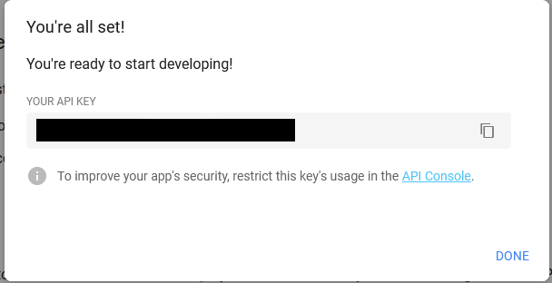

## Démarrer sa configuration

### Activez les API Google

Assurez vous d'identifier le compte Google qui sera utilisé in-fine pour les consultations des datas. 
Connectez vous à ce compte Google
Accédez à [cette page](https://developers.google.com/sheets/api/quickstart/js) et activez les Google Sheets API (premier bouton bleu). Nommez le projet ```DataMiner``` et validez la popup


Copiez en lieu sûr les crédentials qui vous seront donnés. Ces crédentials sont personnels !


Créez une clé api sur la même page (second bouton bleu) pour le projet en opérant de la sorte : 
 * ouverture de la popup
 * clic sur le bouton "back" à gauche de la popup
 * sélection du projet DataMiner
 * clic sur le bouton "next" à droite
 * Stockez également en lieu sûr les crédentials API




Créez un [Google Sheet](https://docs.google.com/spreadsheets/u/0/) dont le nom importe peu. Repérez son identifiant dans l'url et stockez le en lieu sûr

exemple d'url : `https://docs.google.com/spreadsheets/d/xxxxxxxxxxxxffffffffffsssssssssss/edit#gid=894581122`, l'identifiant dans le cas présent serait : `xxxxxxxxxxxxffffffffffsssssssssss`

Il n'est pas nécessaire de préparer les onglets de votre SpreadSheet le programme s'occupera de cela tout seul.

### Configurer le favori


Nous utilisons une subtilité des navigateurs qui va nous permettre de simplifier l'extraction des données 
 * On créé un favori dans la barre personnelle (Crtl + B sous Firefox)
 * On donne le nom souhaité à ce favori (par exemple : DataMiner)
 * On indique comme Adresse la valeur suivante : 

```
javascript:(function(){if(typeof DM_RUNNING !== 'undefined' && DM_RUNNING){throw 'Already launched';}s=document.createElement('script');s.type='text/javascript';s.src='https://besstiolle.github.io/dataMiner/dist/main.js?v='+parseInt(Math.random()*99999999);document.body.appendChild(s);})();
```

Ce petit code permet d'insérer au sein même de notre agenda partagé le reste du code d'extraction des données. Le nom du favoris importe peu.

## 1ère Exécution

Accédez à votre site d'agenda préféré puis cliquez sur le nouveau favoris. Une fenêtre s'ouvre vous demandant des informations : 
 * L'identifiant du Google Sheet précédement récupéré
 * Lidentifiant de votre client google API finissant par .apps.googleusercontent.com précédement récupéré
 * La clé Google API précédement récupérée


En complément vous pouvez renseigner la profondeur de la recherche dans le passé et dans le futur et spécifier l'id de votre unité.

Cliquez et démarrez le minage.

### Connexion à Google

Durant la première exécution du script vous vous retrouverez dans la situation où le script à besoin de votre autorisation pour se connecter à Google Sheet et y enregistrer ses données. La pop-up ressemble alors à ceci


Cliquez sur le bouton Authorize et authentifiez vous sur Google, le process continue alors jusqu'à terminer.


### DataStudio Google (Optionnel)

Vous pouvez accéder à [DataStudio de Google](https://datastudio.google.com) pour créer un rapport après avoir validé les conditions d'utilisation et coché "non" sur le questionnaire pour ne pas être spammé.


Sélectionnez le Google Connectors **Google Sheets**, autorisez l'action, et sélectionnez votre fichier Sheet précédement créé